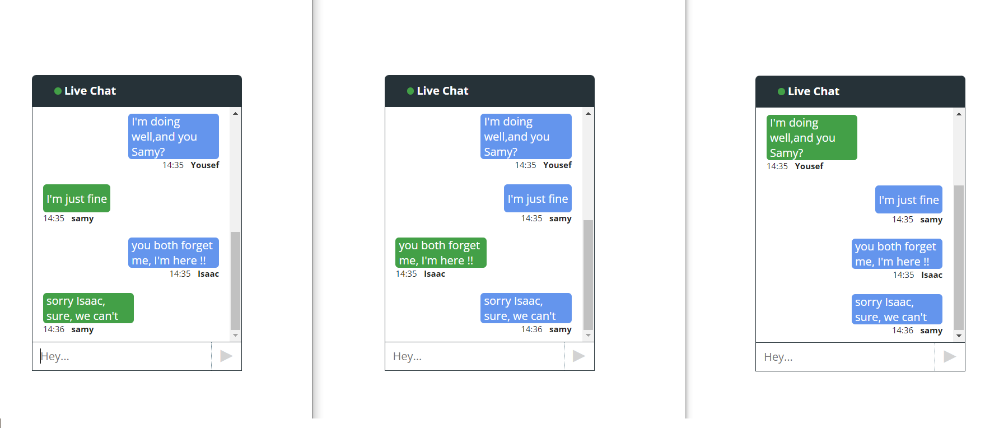
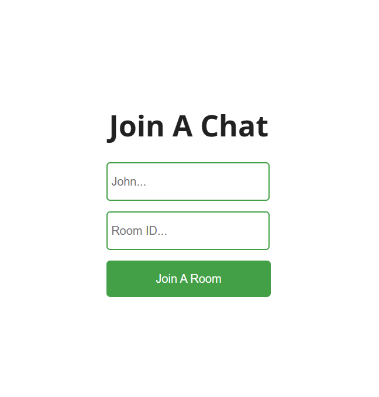

<br />
<div align="center">
  <h1 align="center">Real Time Chat App</h1>
  
</div>

<details>
  <summary>Table of Contents</summary>
  <ol>
    <li>
      <a href="#about-the-project">About The Project</a>
      <ul>
        <li><a href="#built-with">Built With</a></li>
      </ul>
    </li>
    <li>
      <a href="#getting-started">Getting Started</a>
      <ul>
        <li><a href="#prerequisites">Prerequisites</a></li>
        <li><a href="#installation">Installation</a></li>
      </ul>
    </li>
    <li><a href="#usage">Usage</a></li>
    <li><a href="#contact">Contact</a></li>
  </ol>
</details>


<!-- ABOUT THE PROJECT -->
## About The Project




Real-Time Chat Application leverages the power of React, and Node.js along with Socket.io, a real-time communication library, to create a dynamic and responsive chat platform.


### Built With

List of all frameworks/libraries used to bootstrap the App.

* [![React][React.js]][React-url]
* [![Node.js][Node.com]](Node-url)


<!-- GETTING STARTED -->
## Getting Started

To get a local copy up and running follow these simple example steps.

### Prerequisites

* [Node](https://nodejs.org/en)

### Installation


1. Clone the repo
   
   ```sh
   git clone https://github.com/SamyIsaac1/RealTime-Chat-App.git
   ```

3. cd ./server then open cmd 
   ```sh
   npm install
   npm start  
   ``` 

5. cd ./client then open cmd  
   ```sh
   npm install
   npm start
   ```

List of 3rd Parties.
```sh
// backend
// dependencies
cors
express
socket.io

// frontend
react
react-dom
react-router-dom
react-scripts
react-scroll-to-bottom
socket.io-client
```


<!-- USAGE EXAMPLES -->
## Usage
Once the server is running, you can access Task App by opening your web browser and navigating to http://localhost:3000

- Start by joining a room   
<div align="center">
  
</div>

- Chatting with the room's members


<!-- ROADMAP -->
## Contact
Samy Isaac - samyIsaack7@gmail.com - [LinkendIn](https://www.linkedin.com/in/samy-isaac/) 


<!-- Icons -->
[React.js]: https://img.shields.io/badge/React-20232A?style=for-the-badge&logo=react&logoColor=61DAFB
[React-url]: https://reactjs.org/
[Node.com]:https://img.shields.io/badge/Node.js-18.x-green?style=for-the-badge&logo=node.js&logoColor=white
[Node-url]: https://nodejs.org/ 
